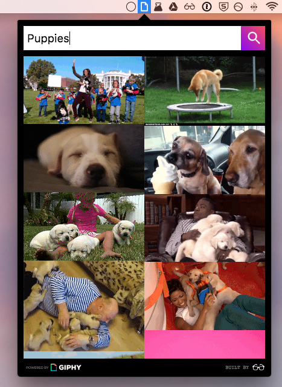

# Gif Bar
An OS X menubar app for searching Giphy.

## Demo

[View a demo of Gif Bar, as a gif, here](http://giphy-menubar.s3.amazonaws.com/gifs/demo.gif).

## Download Demo
This app currently doesn't have a product API key for Giphy, so it could stop working
at any moment. However, if you're cool with that, you can [download the app from here to take it for a spin](https://goo.gl/YoDmgs).

## Local setup
### Install stuff
`npm install`

### Start the app
`npm run start`

### Package the app
`npm run package`

#### Built by
[Pete](http://www.peteroome.com/)
